  

  
  
  

  

---

## Hi, I'm Sameer Alam

I build practical DevOps and full-stack tools for automation, monitoring, documentation, and reliable delivery. My focus is simple: turn manual operational work into repeatable systems that are easier to run, debug, and improve.

<table>
  <tr>
    <td><strong>Role</strong></td>
    <td>DevOps Engineer focused on cloud, automation, monitoring, and infrastructure workflows.</td>
  </tr>
  <tr>
    <td><strong>Core Work</strong></td>
    <td>CI/CD pipelines, Linux operations, containerized delivery, diagnostics, and admin/user platforms.</td>
  </tr>
  <tr>
    <td><strong>Current Focus</strong></td>
    <td>Kubernetes, observability, Infrastructure as Code, deployment workflows, and developer experience.</td>
  </tr>
  <tr>
    <td><strong>Portfolio Theme</strong></td>
    <td>Useful tools, clear documentation, and systems that can be operated confidently.</td>
  </tr>
</table>

---

## Featured Work

<table>
  <tr>
    <td width="50%">
      <h3>IPMG - Advanced Network Monitoring</h3>
      
Python utility for parallel ping checks, hostname resolution, live status visibility, and clean admin reporting.

      

        <a href="https://github.com/sameeralam3127/ipmg">Repository</a>
        ·
        <a href="https://ipmgtool.github.io/">Documentation</a>
      

      
<strong>Focus:</strong> network diagnostics, automation, parallel execution, reporting

    </td>
    <td width="50%">
      <h3>ComputeCentral Docs Portal</h3>
      
DevOps documentation and automation resource hub for scripts, workflows, and reusable operational knowledge.

      

        <a href="https://github.com/sameeralam3127/Devops-automation">Repository</a>
        ·
        <a href="https://computecentral.in/">Live Site</a>
      

      
<strong>Focus:</strong> DevOps automation, docs, reusable scripts, knowledge base

    </td>
  </tr>
  <tr>
    <td width="50%">
      <h3>Monitoring Dashboard</h3>
      
Dashboard project for visualizing system and network analytics with operational visibility and fast scanning in mind.

      

        <a href="https://github.com/sameeralam3127/Monitoring">Repository</a>
        ·
        <a href="https://sameeralam3127.github.io/Monitoring/">Live Site</a>
      

      
<strong>Focus:</strong> observability, dashboards, metrics, UI reporting

    </td>
    <td width="50%">
      <h3>Secure Exam Portal</h3>
      
Online examination platform with admin and student workflows for courses, questions, results, and exam management.

      

        <a href="https://github.com/sameeralam3127/SecureExamPortal">Repository</a>
        ·
        <a href="https://sameeralam3127.pythonanywhere.com/">Live Demo</a>
      

      
<strong>Focus:</strong> full-stack app, role-based workflows, dashboards, education tech

    </td>
  </tr>
</table>

---

## Project Index

| Project | What It Shows | Tech / Focus | Repository | Live |
| --- | --- | --- | --- | --- |
| **IP Management System** | Network checks, hostname resolution, real-time reports | Python, automation, monitoring | [Repo](https://github.com/sameeralam3127/ipmg) | [Live](https://ipmgtool.github.io/) |
| **DevOps Automation** | Practical automation scripts and operational docs | DevOps, scripting, documentation | [Repo](https://github.com/sameeralam3127/Devops-automation) | [Live](https://computecentral.in/) |
| **Monitoring Dashboard** | Operational analytics and status visualization | Monitoring, dashboard UI | [Repo](https://github.com/sameeralam3127/Monitoring) | [Live](https://sameeralam3127.github.io/Monitoring/) |
| **Secure Exam Portal** | Admin/student exam management workflows | Full-stack web app | [Repo](https://github.com/sameeralam3127/SecureExamPortal) | [Live](https://sameeralam3127.pythonanywhere.com/) |
| **Next Platform Starter** | Fast web app starter and deployment workflow | Next.js, frontend, Netlify | [Repo](https://github.com/sameeralam3127/next-platform-starter) | [Live](https://grand-rabanadas-535972.netlify.app/) |
| **Chatbot App** | AI chatbot interface deployed with Streamlit | Python, Streamlit, AI | [Repo](https://github.com/sameeralam3127/chatbot) | [Live](https://chatbot-emf8tv63sn2xhgblihgjeg.streamlit.app/) |

---

## DevOps Toolkit

  

  
  
  
  
  
  
  

---

## How I Build

| Strength | How I Apply It |
| --- | --- |
| **Automation-first thinking** | Convert repeated manual tasks into scripts, pipelines, and reusable workflows |
| **Reliability mindset** | Design for uptime, observability, rollback paths, and clear diagnostics |
| **Documentation habit** | Turn setup steps and operational knowledge into usable docs and portals |
| **Builder energy** | Ship practical tools, learn from usage, and improve systems iteratively |

---

## GitHub Activity

  
  
  

  
  

  

---

