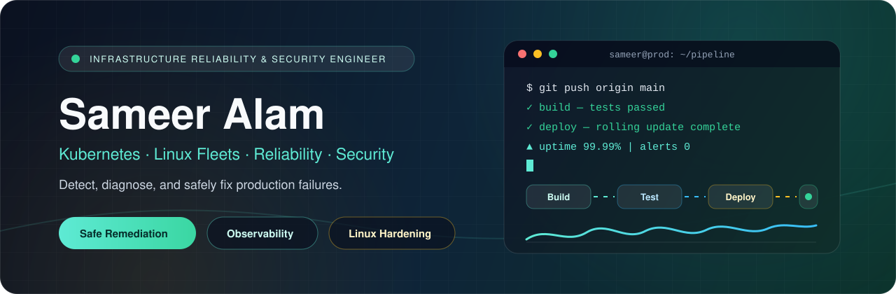

  

## Sameer Alam

**Infrastructure Reliability & Security Engineer** · 8 years

I build tools that detect, diagnose, and safely fix production failures across Kubernetes clusters and Linux fleets.

[Compute Central](https://computecentral.in/) · [KubeRescue](https://sameeralam3127.github.io/KubeRescue/) · [Linux Vitals](https://sameeralam3127.github.io/linux-vitals/) · [IPMG](https://sameeralam3127.github.io/ipmg/)
<!-- TODO: LinkedIn URL — add " · [LinkedIn](https://www.linkedin.com/in/<handle>/)" to the line above -->

## What I build

| Project | Problem it solves | Links |
| --- | --- | --- |
| **KubeRescue** (Go) | Restarting crash-looping pods by hand hides the cause. KubeRescue records the evidence (exit code, restart count, owner) before acting, and every remediation is bounded and dry-run first. Pre-1.0. | [Live](https://sameeralam3127.github.io/KubeRescue/) · [Repo](https://github.com/sameeralam3127/KubeRescue) |
| **Linux Vitals** (Ansible) | Health-checking a mixed RHEL, Ubuntu, and SUSE fleet without installing agents. Compares baseline to post-change state, writes one HTML report, and only fixes things when you opt in. | [Live](https://sameeralam3127.github.io/linux-vitals/) · [Repo](https://github.com/sameeralam3127/linux-vitals) · [Galaxy](https://galaxy.ansible.com/ui/repo/published/sameeralam3127/linux_vitals/) |
| **IPMG** (Python) | Finding which hosts went down since the last scan. Parallel ping sweeps, reverse DNS, and scan-to-scan diffs. `brew install sameeralam3127/tap/ipmg` | [Live](https://sameeralam3127.github.io/ipmg/) · [Repo](https://github.com/sameeralam3127/ipmg) |
| **k8s-kubeadm-lab** (Shell) | Practising etcd recovery, upgrades, and RBAC somewhere it's safe to break: a reproducible multi-node kubeadm cluster across macOS and Windows. | [Repo](https://github.com/sameeralam3127/k8s-kubeadm-lab) |
| **llm-dev-kit** (TypeScript) | Chat and RAG over private PDFs without data leaving the machine: local-first on Ollama, with optional cloud model routing. | [Repo](https://github.com/sameeralam3127/llm-dev-kit) |

## Live tool status

Checked every 6 hours by a [GitHub Actions workflow](.github/workflows/status.yml).

<!-- STATUS:START -->
<!-- status-state: {"checked": "2026-10-07 05:56", "up": {"IPMG": true, "KubeRescue": true, "Linux Vitals": true}} -->
| Tool | Status | Response ms | Last checked (UTC) |
| --- | --- | --- | --- |
| [IPMG](https://sameeralam3127.github.io/ipmg/) | 🟢 Up | 173 | 2026-10-07 05:56 |
| [KubeRescue](https://sameeralam3127.github.io/KubeRescue/) | 🟢 Up | 138 | 2026-10-07 05:56 |
| [Linux Vitals](https://sameeralam3127.github.io/linux-vitals/) | 🟢 Up | 141 | 2026-10-07 05:56 |
<!-- STATUS:END -->

## Upstream contributions

- **IBM/docling-pipelines** — refactor(ollama): hoist repeated imports out of OllamaClient hot-path methods ([#133](https://github.com/IBM/docling-pipelines/pull/133))

<!--
## Demo

TODO: record a KubeRescue demo and save it as assets/kuberescue-demo.gif, then uncomment this section.

How to record (about 30-60 seconds, terminal ~100x30):
  1. Start a throwaway cluster:      kind create cluster --name demo
  2. Deploy a pod that crash-loops:  kubectl run crasher --image=busybox -- sh -c "exit 1"
     (better: a Deployment, so KubeRescue has an owner to act on)
  3. Record:                         asciinema rec demo.cast
     - run KubeRescue with --dry-run and show the evidence it reports
     - run it for real and show the bounded action and the pod recovering
  4. Convert to GIF:                 agg demo.cast assets/kuberescue-demo.gif
  Keep it under ~5 MB so the profile loads quickly.

  

-->

---

Happy to talk about reliability, Kubernetes, Linux automation, and infrastructure security.
